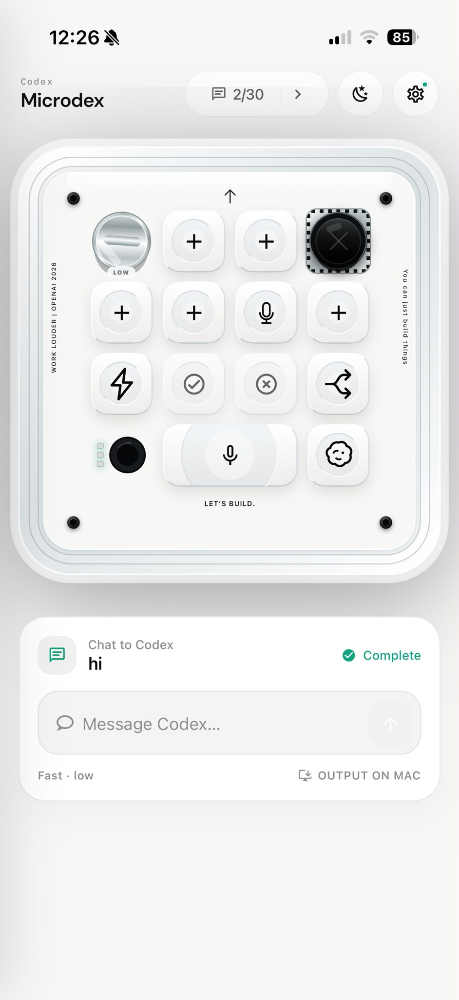

# Microdex

<p align="center">
  
</p>

<h3 align="center">The missing mobile companion for Codex.</h3>

<p align="center">
Control your local Codex runtime directly from your iPhone.
</p>

<p align="center">
  
  
</p>

---

Microdex is an independent React Native client for Codex, inspired by the Codex
Micro control layout: six RGB Task Keys, six Command Keys, an analog joystick,
and a reasoning dial.

It runs on iOS through Expo and connects to a desktop bridge backed by Codex
App Server. The pairing QR uses a stable encrypted Cloudflare relay, so the
phone can use Wi-Fi or mobile data without sharing the Mac's network.

> Independent community project. Not affiliated with OpenAI or Work Louder.

---

## ✨ Features

- 📱 Control Codex remotely from your iPhone
- 🎮 Codex Micro-inspired interface
- ⚡ Fast Mode toggle
- 🧠 Reasoning control
- 🎤 Voice input
- ✅ Approval requests
- 🔄 Live task updates
- 🌈 RGB Task Keys
- 🌍 Secure remote control over Wi-Fi or mobile data

---

## 🚀 Quick Start

Requirements: macOS, Node.js 20.19+, and Codex installed and logged in. The phone
and Mac do not need to use the same Wi-Fi network.

1. Install the desktop CLI:

```bash
npm install --global microdex-cli@latest
```

2. Install and start the automatic desktop bridge:

```bash
microdex setup
```

The CLI installs a private runtime under `~/.microdex`, registers a macOS
LaunchAgent, starts the local Codex connection and a secure outbound relay,
then displays the pairing QR. No router port or public IP is required. The Mac
keeps the same relay address across bridge restarts.

3. Open Microdex on your iPhone, tap **Pair Mac**, then scan the QR inside the
app. After pairing, the Terminal can be closed: the bridge starts
automatically when you log into the Mac. The saved pairing reconnects whenever
the Mac is awake and online, even if the phone switches between Wi-Fi and
mobile data.

Before pairing, **Explore without a Mac** opens a completely local walkthrough with fictional
tasks. It never contacts a Mac, Cloudflare, Codex, or OpenAI. The real pairing
flow asks the user to review and accept the data-processing explanation before
any command or message can leave the phone.

You can check a Mac before pairing with `microdex doctor`, or see whether the
bridge is already active with `microdex status`. Use `microdex pair` for a fresh
one-time QR and `microdex restart` if the background service needs restarting.

During development, `microdex up` still runs the bridge in the current Terminal.

---

## 🌉 Why the bridge is required

iOS cannot directly reach the local Codex runtime. The authenticated
bridge starts the installed Codex App Server and:

- reads the six most recent real Codex tasks;
- sends phone messages through the visible Codex desktop composer;
- changes Fast Mode and reasoning for the selected task;
- sends or steers messages directly and follows live task state;
- resolves approval requests and forks conversations;
- opens a selected task through supported `codex://` desktop links.

The microphone key opens the mobile composer. Use iOS keyboard
dictation, then press the Codex key to send without macOS Accessibility access.

---

## 🎮 Native Micro Mode

For the closest parity with the physical Codex Micro, start the optional native
channel after `microdex setup`:

```bash
microdex native
```

The command asks before closing and reopening Codex. It does not modify the
Codex app bundle. Codex sees a local synthetic Micro, so the standard Fast,
approval, split, microphone, send, joystick, dial, task-light, and frame-light
messages use Codex's own hardware channel. The six phone keys remain
programmable; actions that do not exist on the physical Micro continue through
the authenticated standard bridge.

Use `microdex native status`, `microdex native test`, or
`microdex native stop` to inspect, verify, or leave the mode.

---

## App Review access

The native **Explore without a Mac** path lets a reviewer exercise the interface immediately
without credentials or external hardware. To let App Review verify the full
Mac-to-phone path, prepare a dedicated clean review Mac and run:

```bash
microdex review-pair
```

This creates a private, single-use encrypted pairing QR that expires after seven
days. Attach it only in App Store Connect review notes, keep that Mac awake and
online during review, and run `microdex revoke-all` when review finishes. See
[docs/APP_REVIEW_RUNBOOK.md](docs/APP_REVIEW_RUNBOOK.md) for the complete flow.

---

## 🔗 How it connects to Codex

The CLI does not ask for OpenAI credentials and does not sign in as the user.
It starts the `codex app-server` runtime bundled with the installed Codex app,
then talks to it over a loopback WebSocket on the Mac. This provides tasks,
settings, approvals, and live state.

Actions that operate the visible desktop interface use the local
`MicrodexDesktop` accessibility companion. The iPhone connects to the
authenticated Microdex bridge through HTTPS/WSS; Codex and its login
credentials remain on the Mac.

No macOS Accessibility permission is needed for the core remote controls.

---

## ⚙️ Direct Codex Scripts

These commands modify the local Codex configuration:

```bash
npm run fast:on
npm run fast:off
npm run fast:status
node bridge/scripts/set-reasoning.mjs high
```

Test without touching your real configuration:

```bash
node bridge/scripts/set-fast.mjs on --config /tmp/microdex-test-config.toml
```

---

## 🔒 Security

- Every bridge action requires an authenticated credential stored with mode `0600` in `~/.microdex/access-token`.
- The QR contains a separate one-time pairing code, expires after 10 minutes, and cannot be reused after a successful claim.
- `microdex review-pair` is an explicit App Review exception: its QR expires after seven days but remains single-use and is invalidated by a bridge restart or `revoke-all`.
- Every new pairing creates a separate 256-bit end-to-end encryption key. The key is carried in the QR URL fragment, which is not sent to the relay.
- Commands, messages, task state, the persistent bridge credential, and live events are encrypted between the phone and Mac with authenticated XChaCha20-Poly1305. Cloudflare relays ciphertext and cannot decrypt their contents.
- The persistent bridge credential and encryption key are returned only inside the encrypted pairing exchange and are stored in the iOS Keychain by the app.
- Remote access uses an outbound-only Cloudflare Worker relay and never opens a router port.
- The public relay rejects legacy unencrypted remote sessions. Existing beta users scan one fresh QR after upgrading.
- A Cloudflare Quick Tunnel is available only as an explicit development fallback; its bundled `cloudflared` archive is pinned and verified with SHA-256 before execution.
- Public HTTP bridge addresses are rejected; remote pairing must use HTTPS.
- The phone cannot submit arbitrary commands.
- Local hooks use predefined names inside `bridge/hooks/`.
- `microdex revoke-all` rotates the bridge credential, removes every paired phone key, and requires a fresh QR on each phone.

Useful environment variables:

```bash
MICRODEX_TOKEN=a-long-secret npm run bridge
MICRODEX_PORT=3210 npm run bridge
MICRODEX_CONFIG_PATH=/path/to/config.toml npm run bridge
MICRODEX_REMOTE_ACCESS=0 npm run bridge
MICRODEX_RELAY_URL=https://your-relay.example.com npm run bridge
MICRODEX_QUICK_TUNNEL=1 npm run bridge
MICRODEX_ALLOW_LEGACY_REMOTE=1 npm run bridge
MICRODEX_CLOUDFLARED_BIN=/path/to/cloudflared npm run bridge
```

Microdex creates a random relay identity on the Mac and stores it with mode
`0600` in `~/.microdex/relay-device.json`. Restarting the bridge reuses that
identity and the same public HTTPS address, so a paired phone does not need a
new QR. If the Mac is offline or asleep, the app waits and reconnects
automatically when the bridge returns. The relay stores only a one-way digest
of the Mac connector secret; it never stores phone credentials or end-to-end
keys. Use `microdex uninstall --purge` to remove the durable relay room and all
local bridge credentials.

See [PRIVACY.md](PRIVACY.md) for the project privacy policy and
[docs/APP_STORE_RELEASE.md](docs/APP_STORE_RELEASE.md) for the release checklist.

---

## ⚠️ Current Limitation

Microdex controls turns that it resumes or starts through its own Codex App
Server connection. The original physical keyboard uses a private first-party
desktop channel, so a third-party app cannot attach to an already in-flight turn
owned by a different desktop process. Select the task in Microdex before sending
new work to keep subsequent status and approvals live.

Expo Go is used only for development previews. Public versions are distributed
as signed EAS builds through TestFlight and the App Store.

---

## ❤️ Attribution

The optional native channel is adapted from the MIT-licensed
`maxxspotter/codex-micro-app`, including its `node-hid` interception layer based
on Marcel Pociot's MIT-licensed Codex Micro emulator. Both license notices are
included in `bridge/native-shim/`.
